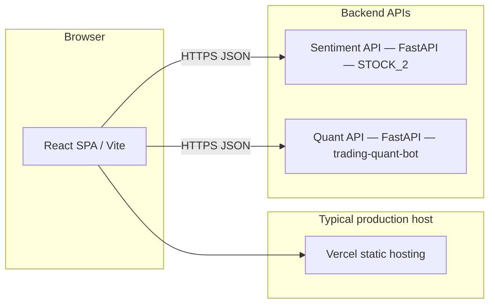

# SentinelQuant — Unified Market Analysis Platform

This repository is a **mono-repo** that combines a **React single-page application (SPA)** with two **Python FastAPI** backends: one for **news-driven sentiment** and one for **technical quant strategies and backtesting**. The SPA calls both APIs from the browser so users can run sentiment and quant analysis in one workflow without switching between separate apps.

---

## 1. High-level architecture



| Layer | Role | Primary stack |
|--------|------|----------------|
| **SPA** | UI, orchestration, charts | React 18, TypeScript, Vite 5, Tailwind, Radix/shadcn-style components, Plotly.js (`plotly.js-dist-min`) |
| **Sentiment API** | Symbol lists, search, sentiment prediction, price series | FastAPI, pandas, yfinance, scikit-learn joblib model, PyTorch + Hugging Face Transformers (FinBERT), optional Streamlit legacy dashboard in same folder |
| **Quant API** | Indicators, strategies, backtests, Plotly chart JSON | FastAPI, pandas, yfinance, Plotly, existing quant pipeline (`data_fetcher`, `indicators`, `trading_strategies`, `backtester`, `chart_generator`) |

**Configuration:** the SPA reads backend base URLs from Vite env vars at build/runtime:

- `VITE_SENTIMENT_API_URL` — base URL of the sentiment FastAPI service  
- `VITE_QUANT_API_URL` — base URL of the quant FastAPI service  

Defaults in code fall back to local dev URLs if unset (see `sentiment-quant-edge-main/.env.example`).

**CORS:** both FastAPI apps use permissive `CORSMiddleware` (`allow_origins=["*"]`) so the Vercel-hosted SPA can call APIs on different origins during development and demos.

---

## 2. Repository layout

| Path | Purpose |
|------|---------|
| `sentiment-quant-edge-main/` | **Frontend SPA** — Vite + React; main UI lives in `src/pages/Index.tsx` |
| `STOCK_2/` | **Sentiment backend** — `api_server.py` (FastAPI), `sentiment_system/` (prediction pipeline), `dashboard.py` (legacy Streamlit) |
| `trading-quant-bot-main/trading-quant-bot-main/` | **Quant backend** — `stock_quant_project/api_server.py` plus indicators, strategies, backtesting, Plotly chart generator |
| `SentinelQuantApp/` | Older bundled Streamlit-style layout (reference / legacy); not required for the unified SPA path |
| `render.yaml` | Example **Render** blueprint: two web services with root dirs and `uvicorn` start commands |

---

## 3. How the SPA works (`sentiment-quant-edge-main`)

### 3.1 Routing and shell

The app uses **React Router**; the primary screen for this project is the **`Index`** page (`src/pages/Index.tsx`). The UI is a single scrollable workflow: controls at the top, then sentiment block, then quant performance summary, chart, tables, trade logs, and strategy reference.

### 3.2 State and user inputs

The page keeps client-side state for:

- **Market:** `US` vs `INDIA` (NIFTY 50 universe for India).  
- **Symbol:** free text with **`<datalist>` suggestions** driven by the sentiment API (debounced search for US via Yahoo-style search; filtered CSV list for India).  
- **Timeframe:** `15m`, `30m`, `1h`, `1d` — forwarded **only** to the quant API (sentiment path uses its own data sources).  
- **Strategies:** subset of `{ ma, rsi, macd, bb, ema }` toggled via pills; sent to the quant API.  
- **Results:** `sentimentResult`, `quantResult`, loading and error flags.  
- **Chart signal:** `selectedSignalColumn` — which strategy’s Plotly figure is shown (defaults to quant API’s `best_strategy.strategy`).

### 3.3 Network behaviour

1. **On market change** — `GET /api/sentiment/symbols?market=…` loads an initial symbol list and seeds the symbol field.  
2. **On symbol query change** (debounced ~220 ms) — `GET /api/sentiment/symbol-search?market=…&q=…` refreshes suggestion symbols (US: Yahoo finance search API; India: CSV filter).  
3. **On “Run Full Analysis”** — `Promise.all` fires in parallel:  
   - `POST /api/sentiment/analyze` with `{ symbol, market }`  
   - `POST /api/quant/analyze` with `{ symbol, market, timeframe, strategies }`  

If either response is non-OK, the SPA surfaces `detail` from the JSON body as the error message.

### 3.4 Presentation logic

- **Currency:** derived from **market** (`INDIA` → INR / ₹, `US` → USD / $).  
- **Sentiment block:** prediction, probabilities, news snippets, optional latest close from `price_chart`.  
- **Quant block:**  
  - **Performance summary** — KPIs aligned with the original quant dashboard narrative (returns, trades, drawdown, Sharpe, etc.).  
  - **Chart** — **Plotly figures are not recreated in TypeScript**; the quant API returns **serialized Plotly JSON** (`chart_figures` keyed by signal column). The SPA mounts `Plotly.react(...)` on a `div` ref when `quantResult` or `selectedSignalColumn` changes, and purges on teardown.  
  - **Comparison table** — `comparison` array from the API.  
  - **Trade logs** — per-strategy rows from `trade_logs`.  
  - **Strategy reference** — human-readable names, descriptions, and rules from `strategy_reference`.

This design keeps **visual parity** with the original Streamlit quant charts by **reusing `generate_chart`** server-side and only rendering JSON client-side.

---

## 4. Backend behaviour (concise)

### 4.1 Sentiment API (`STOCK_2/api_server.py`)

| Endpoint | Method | Purpose |
|----------|--------|---------|
| `/health` | GET | Liveness check |
| `/api/sentiment/symbols` | GET | List symbols by market (India: NIFTY CSV; US: fallback list) |
| `/api/sentiment/symbol-search` | GET | Search / filter symbols (US: external finance search; India: CSV) |
| `/api/sentiment/analyze` | POST | Resolve company name → fetch headlines → FinBERT + RF pipeline → optional price chart via yfinance |
| `/api/sentiment/market-overview` | GET | Bullish/bearish ranking via `rank_market` |

Ticker normalization: Indian symbols may use `.NS` suffix where appropriate inside helpers used by chart and resolution logic.

### 4.2 Quant API (`stock_quant_project/api_server.py`)

| Endpoint | Method | Purpose |
|----------|--------|---------|
| `/health` | GET | Liveness check |
| `/api/quant/analyze` | POST | Fetch OHLCV → indicators → selected strategies → **backtest each** → best strategy → **Plotly JSON per strategy** → strategy metadata → serialized trade logs |

Indian market: symbols get `.NS` suffix when market indicates India and the symbol does not already end with `.NS`.

Internal mapping from timeframe to yfinance **period** is centralized (`PERIOD_MAP`).

---

## 5. Local development (overview)

### 5.1 Sentiment API

From `STOCK_2/` (with Python 3.11 recommended):

```bash
pip install -r requirements.txt
uvicorn api_server:app --reload --host 0.0.0.0 --port 8601
```

### 5.2 Quant API

From `trading-quant-bot-main/trading-quant-bot-main/`:

```bash
pip install -r requirements.txt
uvicorn stock_quant_project.api_server:app --reload --host 0.0.0.0 --port 8602
```

### 5.3 Frontend

From `sentiment-quant-edge-main/`:

```bash
npm install
```

Copy `.env.example` to `.env.local` (or `.env`) and set:

```env
VITE_SENTIMENT_API_URL=http://localhost:8601
VITE_QUANT_API_URL=http://localhost:8602
```

```bash
npm run dev
```

---

## 6. Deployment notes (typical setup)

| Component | Common host | Notes |
|-----------|----------------|--------|
| SPA | **Vercel** | Root directory = `sentiment-quant-edge-main`; build `npm run build`; output `dist`; set `VITE_*` env vars to public API URLs. `vercel.json` provides SPA fallback rewrites. |
| APIs | **Render**, **VPS**, etc. | `render.yaml` documents two Python web processes. **Sentiment** service is **memory-heavy** (PyTorch + Transformers + FinBERT); many **512 MB** free tiers are insufficient. |

---

## 7. Operational constraints (for reports / risk sections)

- **Cold start & RAM:** first inference may download Hugging Face weights and loads PyTorch; plan hosting **RAM** accordingly.  
- **External dependencies:** sentiment uses RSS/news and finance APIs; quant uses market data fetchers — network failures surface as HTTP errors to the SPA.  
- **Security:** open CORS is convenient for class demos; production hardening would restrict origins and add auth/rate limits.

---

## 8. Summary sentence (elevator pitch)

**SentinelQuant** exposes a **single React SPA** that orchestrates **parallel REST calls** to a **sentiment microservice** (news + ML) and a **quant microservice** (indicators + strategies + backtests + Plotly chart JSON), delivering a **unified market analysis** experience suitable for deployment with **static frontend hosting** and **separate Python API hosts**.
