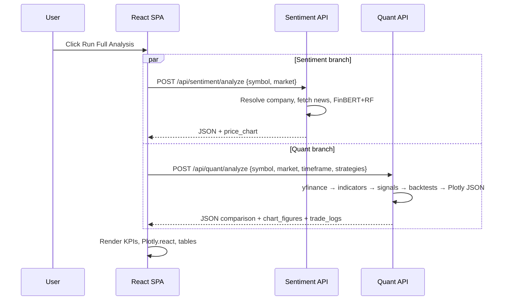

# SentinelQuant — Detailed Project Report Reference

This document is a **technical reference and chapter blueprint** for producing an extended project report (for example, **~50 pages** including figures, tables, bibliography, and appendices). It describes the **as-built system** in the repository: architecture, algorithms, APIs, frontend behaviour, deployment, risks, and suggested narrative hooks you can expand with citations, screenshots, and experiments.

**Companion files:** root `README.md` (concise overview), `render.yaml` (example API hosting).

---

## How to use this reference for a ~50-page report

| Final report section | Suggested page budget | What to lift from this doc |
|---------------------|----------------------|----------------------------|
| Title, abstract, keywords | 1–2 | Executive summary + novelty bullets |
| Introduction & motivation | 4–6 | Problem statement, objectives, user stories |
| Literature / related work | 6–10 | “Topics to cite” lists; expand with papers on FinBERT, TA, backtesting |
| Requirements & methodology | 4–6 | Functional/non-functional requirements; system methodology |
| System design & architecture | 8–12 | Diagrams, decomposition, data flows |
| Implementation | 10–15 | File-level mapping, algorithms, API specs, frontend detail |
| Testing & evaluation | 4–8 | Proposed tests; optional benchmarks you run |
| Deployment & ops | 3–5 | Hosting topology; RAM/build notes |
| Legal, ethics, disclaimer | 2–3 | Not investment advice; data TOU |
| Conclusion & future work | 2–4 | Limitations + roadmap |
| Appendices | 5–10 | API payloads, folder trees, env vars, glossary |

**Figures to generate for the PDF:** architecture diagram, sequence diagram for “Run Full Analysis”, screenshot of SPA sections, sample Plotly chart export, ER-style table of API fields, confusion matrix or calibration plot if you run ML evaluation.

---

## 1. Executive summary

**SentinelQuant** is a web-based **unified market analysis** application. A **React SPA** (`sentiment-quant-edge-main`) lets users choose **US or Indian (NIFTY 50)** equities, select **technical strategies** and **timeframe**, then run **one action** that triggers **two parallel analyses**:

1. **Sentiment path** — retrieves **recent news headlines**, scores them with **Prosus FinBERT** via Hugging Face Transformers, aggregates features, and applies a **Random Forest classifier** (serialized as `random_forest_model.pkl`) to emit **UP/DOWN** probabilities and headline excerpts. Price context uses **yfinance**.

2. **Quant path** — downloads OHLCV via **yfinance**, computes **standard indicators** (SMA/EMA, RSI, MACD, Bollinger), derives **discrete BUY/SELL/HOLD signals** per strategy, runs a **long-only backtester** per strategy, ranks outcomes, serializes **Plotly** chart JSON using the **same chart generator** as the legacy Streamlit quant dashboard, and returns **trade logs** and **strategy reference** text.

**Deployment pattern:** static SPA (e.g. **Vercel**) + **two separate FastAPI** processes (sentiment + quant). **CORS** is open for demo/portfolio use; production would tighten origins.

---

## 2. Problem statement

Retail and student analysts often juggle **disparate tools**: one stack for ** NLP sentiment**, another for **technical rules and backtests**. Switching contexts loses reproducibility and comparison. This project consolidates:

- **Qualitative / news-based** directional inference (probabilistic, not oracle truth).
- **Quantitative / rule-based** simulation on historical bars with explicit performance metrics.

**Constraints embodied in code:** browser-only UI (no secrets in client), **REST JSON** contracts, **Indian tickers** normalized with `.NS` where required, **symbol discovery** adapted per market (CSV universe vs Yahoo search).

---

## 3. Objectives & success criteria

### 3.1 Functional objectives

| ID | Objective | Implementation anchor |
|----|-----------|------------------------|
| O1 | Single-page workflow | `sentiment-quant-edge-main/src/pages/Index.tsx` |
| O2 | Parallel sentiment + quant | `Promise.all` POST to both APIs |
| O3 | Market-aware symbols | `GET .../symbols`, `GET .../symbol-search` |
| O4 | Strategy selection | Toggle keys `ma|rsi|macd|bb|ema` → quant API |
| O5 | Comparable charts to legacy quant UI | `generate_chart` → `chart_figures` → `Plotly.react` |
| O6 | Transparency | Trade logs + strategy reference cards |

### 3.2 Non-functional objectives

- **Separation of concerns:** SPA vs two APIs enables independent scaling (critical for ML RAM).
- **Reproducibility:** deterministic server-side pipeline given same vendor data snapshot (subject to yfinance variability).
- **Extensibility:** add strategies in `trading_strategies.py`; expose via API automatically if wired in `STRATEGY_TO_SIGNAL_COL`.

---

## 4. Related work & bibliography seeds

Expand each bullet into 1–3 pages with citations in your institution’s style.

- **Financial NLP:** FinBERT (ProsusAI), sentiment transfer learning, limitations of headline-only signals.
- **Market microstructure & noise:** why retail NLP signals are noisy; lookahead and survivorship (discuss honestly).
- **Technical analysis criticism:** academic literature on TA efficacy; still pedagogically valuable for strategy engineering.
- **Backtesting pitfalls:** overfitting, parameter mining, transaction costs (current engine uses simplified friction-free model).
- **Modern web architecture:** SPAs, BFF vs direct API calls, CORS, JWT (not implemented here).
- **MLOps:** model serialization (`joblib`), cold start, GPU vs CPU inference.

---

## 5. System methodology

**Approach:** iterative prototyping → encapsulate legacy Streamlit logic behind FastAPI → unify UX in React → preserve chart parity by **server-side Plotly generation**.

**Data flow paradigm:** pull-based HTTP; **no WebSockets**. Suitable for coursework demos; streaming quotes would be future work.

---

## 6. High-level architecture

### 6.1 Logical decomposition

```
[ Browser: React SPA ]
        |  HTTPS JSON (fetch)
        +--> [ Sentiment API : FastAPI : STOCK_2 ]
        |
        +--> [ Quant API : FastAPI : trading-quant-bot-main/... ]
```

### 6.2 Deployment topology (typical)

```
[Vercel / CDN]  --static-->  SPA assets (dist/)
[Vercel env]               VITE_SENTIMENT_API_URL, VITE_QUANT_API_URL

[Host A]  uvicorn sentiment API :8601 (example)
[Host B]  uvicorn quant API     :8602 (example)
```

### 6.3 Sequence: “Run Full Analysis”



---

## 7. Technology stack

### 7.1 Frontend (`sentiment-quant-edge-main`)

| Layer | Technology | Notes |
|-------|------------|--------|
| Tooling | Vite 5, TypeScript | Fast dev, ESM |
| UI | React 18 | Hooks (`useState`, `useEffect`, `useMemo`, `useRef`) |
| Styling | Tailwind CSS 3.x | Utility-first |
| Components | Radix UI primitives, shadcn-style wrappers | Accessible patterns |
| Charts | `plotly.js-dist-min` | Renders server-produced figures |
| Icons | `lucide-react` | Header/footer branding |

Key page: `src/pages/Index.tsx` — **single orchestrator** for the product surface.

### 7.2 Sentiment backend (`STOCK_2`)

| Component | Technology |
|-----------|------------|
| Framework | FastAPI + Uvicorn |
| HTTP client | `requests` (Yahoo search endpoint for US symbols) |
| Market data | `yfinance` |
| NLP | `transformers`, `torch`, model `ProsusAI/finbert` |
| Classical ML | `scikit-learn` RF loaded via `joblib` |
| RSS | `feedparser` (Google News RSS query) |
| Legacy UI | `streamlit` + `dashboard.py` (optional; not required for SPA) |

### 7.3 Quant backend (`trading-quant-bot-main/trading-quant-bot-main`)

| Component | Technology |
|-----------|------------|
| Framework | FastAPI + Uvicorn |
| Data | `yfinance` via `stock_quant_project/data/data_fetcher.py` |
| Indicators | `stock_quant_project/indicators/indicators.py` |
| Strategies | `stock_quant_project/strategies/trading_strategies.py` |
| Backtest | `stock_quant_project/backtesting/backtester.py` |
| Charts | `stock_quant_project/dashboard/chart_generator.py` + Plotly |

---

## 8. Repository structure (implementation map)

| Path | Responsibility |
|------|----------------|
| `sentiment-quant-edge-main/src/pages/Index.tsx` | SPA layout, fetch orchestration, Plotly mount, tables |
| `sentiment-quant-edge-main/vercel.json` | SPA fallback rewrites |
| `STOCK_2/api_server.py` | Sentiment REST surface |
| `STOCK_2/sentiment_system/predictor.py` | FinBERT + RF pipeline, lazy singleton models |
| `STOCK_2/sentiment_system/data/*.csv` | Training/feature/NIFTY datasets (historical artifacts) |
| `STOCK_2/models/random_forest_model.pkl` | Serialized classifier |
| `STOCK_2/market_ranker.py` | NIFTY-wide ranking with 600s in-process cache |
| `STOCK_2/requirements.txt`, `STOCK_2/runtime.txt` | Dependencies & Python pin |
| `.../stock_quant_project/api_server.py` | Quant REST surface |
| `.../stock_quant_project/data/data_fetcher.py` | OHLCV ingestion |
| `.../stock_quant_project/indicators/indicators.py` | Indicator column definitions |
| `.../stock_quant_project/strategies/trading_strategies.py` | Signal columns + `strategies_info` metadata |
| `.../stock_quant_project/backtesting/backtester.py` | Portfolio simulation + metrics |
| `.../stock_quant_project/dashboard/chart_generator.py` | Plotly figure factory |
| `render.yaml` | Example dual-service Render blueprint |
| `README.md` | Short operational overview |

Legacy: `SentinelQuantApp/` — bundled older layout; report may mention as superseded by SPA.

---

## 9. Detailed specification — Sentiment subsystem

### 9.1 REST endpoints (`STOCK_2/api_server.py`)

| Endpoint | Method | Query/body | Success shape | Errors |
|----------|--------|------------|---------------|--------|
| `/health` | GET | — | `{"status":"ok"}` | — |
| `/api/sentiment/symbols` | GET | `market` | `{ market, symbols[] }` | Empty India list if CSV missing |
| `/api/sentiment/symbol-search` | GET | `market`, `q` | `{ market, symbols[] }` | US falls back on HTTP failure |
| `/api/sentiment/analyze` | POST | `{ symbol, market }` | sentiment dict + `company`, `market`, `price_chart` | 400 resolve fail; 404 no news |
| `/api/sentiment/market-overview` | GET | — | `{ bullish[], bearish[] }` | Empty if no predictions |

**US symbol search:** HTTP GET to Yahoo finance search API (`query2.finance.yahoo.com`) with basic filtering (equity-like symbols, exclude dotted tickers for simplicity).

**India symbols:** `sentiment_system/data/nifty50_stocks.csv` drives universe and company resolution.

### 9.2 Company resolution

- **India:** CSV lookup on ticker → company name.
- **US:** `yf.Ticker(symbol).info` prefers `shortName` / `longName`.

### 9.3 Price chart helper

`get_stock_chart`: `yfinance.download` (or equivalent path via `yf.download`) — **3 months**, **1d** interval; returns `{Date, Close}` rows JSON-serializable.

### 9.4 News ingestion & filtering (`predictor.fetch_latest_news`)

- Builds Google News RSS URL with **company + stock + market** query context (`hl=en-IN`, `gl=IN`).
- Filters:
  - Drops headlines matching **sports** lexicon (reduce false positives).
  - Requires **finance keywords** (earnings, revenue, etc.).
  - Requires mention of **company name or ticker** (case-insensitive).

**Report angle:** discuss **bias** toward English India-centric RSS parameters even for US symbols — methodological limitation.

### 9.5 FinBERT inference (`predictor.analyze_sentiment`)

For each headline:

1. Tokenize with FinBERT tokenizer (`return_tensors="pt"`, truncation, padding).
2. Forward pass under `torch.no_grad()`.
3. Softmax logits → take **positive** vs **negative** class probabilities (indices 2 and 0 in current code path).
4. **Sentiment score** = positive − negative per headline.

Aggregate:

- `sentiment_mean` = mean of headline scores.
- `news_count` = number of headlines used.

### 9.6 Feature vector for Random Forest

The RF expects a **6-dimensional** feature row (see code comments: must match training):

```text
[ news_count, rolling_3, rolling_7, 0, 0, 0 ]
```

Where `rolling_3` and `rolling_7` are currently **placeholders** set equal to `sentiment_mean` (document honestly in report — architectural debt vs original training script).

### 9.7 Random Forest output mapping

`predict_proba` → normalize two-class probabilities to sum to 1 → label **UP** if upside probability exceeds downside.

### 9.8 Model loading strategy

`load_models()` uses **lazy singleton** + `threading.Lock`:

1. Load `joblib` RF from `STOCK_2/models/random_forest_model.pkl`.
2. Download/load FinBERT tokenizer + weights from Hugging Face hub on first use.

**Ops implication:** first request after deploy may be slow; **RAM** must accommodate PyTorch + HF model + pandas — often **>512 MB** on small PaaS tiers.

### 9.9 Market ranking (`market_ranker.rank_market`)

Iterates NIFTY CSV rows, calls `predict_stock`, sorts by probabilities, returns top bullish/bearish. Uses **600-second TTL cache** to reduce repeated FinBERT load.

---

## 10. Detailed specification — Quant subsystem

### 10.1 REST endpoints (`stock_quant_project/api_server.py`)

| Endpoint | Method | Body | Behaviour |
|----------|--------|------|-----------|
| `/health` | GET | — | Liveness |
| `/api/quant/analyze` | POST | `QuantRequest` | Full pipeline |

**QuantRequest fields:**

- `symbol: str`
- `market: str` — if starts with `IN` and symbol lacks `.NS`, append `.NS`.
- `timeframe: str` — regex `^(15m|30m|1h|1d)$`.
- `strategies: list[str]` — filtered to known keys.

**PERIOD_MAP (timeframe → yfinance period):**

| UI timeframe | Yahoo period |
|-------------|--------------|
| 15m | 5d |
| 30m | 1mo |
| 1h | 3mo |
| 1d | 6mo |

### 10.2 Data fetch (`data_fetcher.fetch_stock_data`)

- Uses `yf.Ticker(symbol).history(interval=..., period=...)`.
- Normalizes columns to `Date, Open, High, Low, Close, Volume`.
- Prints diagnostic lines (useful in server logs; mention noise in production logging policy).

### 10.3 Indicators (`calculate_indicators`)

Columns added (document formulas in report prose):

| Column | Definition (summary) |
|--------|---------------------|
| SMA_20 | 20-period SMA of Close |
| EMA_20 | 20-period EMA of Close |
| RSI_14 | Wilder-style smoothing via `ewm(com=13)` on gains/losses |
| MACD | EMA12 − EMA26 of Close |
| MACD_signal | 9-period EMA of MACD |
| MACD_hist | MACD − MACD_signal |
| BB_upper / BB_lower | SMA_20 ± 2σ (20-period rolling std) |

**Student extension ideas:** parameterize windows via API; NaN handling first bars.

### 10.4 Strategies (`trading_strategies.py`)

Each strategy writes a **signal column** consumed by the backtester.

**Metadata registry (`strategies_info`)** — verbatim rules strings returned to SPA:

| Key | Signal column | Rule summary (from code) |
|-----|----------------|---------------------------|
| `ma` | `MA_signal` | SMA_20 > EMA_20 → BUY; < → SELL; else HOLD |
| `rsi` | `RSI_signal` | RSI_14 < 30 BUY; > 70 SELL; else HOLD |
| `macd` | `MACD_signal_trade` | Bull/bear crossover vs MACD_signal |
| `bb` | `BB_signal` | Close < lower BUY; > upper SELL; else HOLD |
| `ema` | `EMA_signal` | EMA_12 vs EMA_26 crossover |

### 10.5 Backtester mechanics (`backtester.backtest`)

**Assumptions (critical for report honesty):**

- **Long-only**, **all-in** allocation: a BUY spends entire cash at close; one position max.
- **No commissions, slippage, taxes, borrow fees**.
- Signals executed implicitly at row’s Close when BUY/SELL appears (no explicit latency model).

**Loop:**

1. Track `cash`, `shares`, `buy_price`, `trade_log`, `portfolio_values`.
2. Append **pre-trade** portfolio value `cash + shares * Close` each bar.
3. On BUY with cash > 0: convert all cash to shares at price.
4. On SELL with shares > 0: liquidate; compute round-trip **Profit** vs `buy_price`.
5. End: force liquidation if still holding.

**Metrics:**

- `final_value`, `total_return` vs `INITIAL_CAPITAL` (10_000 in engine — SPA displays KPIs using API numbers; UI uses `INITIAL_CAPITAL = 10000` only for colour thresholds).
- `total_trades` = count of SELL rows (including final liquidation tag).
- `win_rate` over sells with `Profit > 0`.
- `max_drawdown` from running peak of portfolio curve (%).
- `sharpe_ratio` annualized from daily portfolio returns, rf=0 (document sensitivity to bar frequency).

### 10.6 Chart generation

For each selected strategy key:

1. Call `generate_chart(df_sigs, strategy_column=..., show_sma/ema/bb flags, open_in_browser=False)`.
2. Serialize via `fig.to_plotly_json()` with `PlotlyJSONEncoder`.
3. SPA selects figure by **signal column name**.

**Why this matters academically:** avoids duplicating visual semantics in JS — single source of truth in Python.

### 10.7 API response composition

Returns:

- Identity: `symbol`, `market`, `timeframe`, `period`
- `best_strategy` — first row of comparison sorted by `total_return`
- `comparison` — per-strategy metrics
- `chart_figures` — Plotly JSON dict keyed by signal column
- `chart_rows` — trimmed OHLCV + signal columns (recent tail)
- `strategy_reference` — human-readable strings
- `trade_logs` — dict keyed by signal column → list of trade dicts

---

## 11. Frontend deep dive (`Index.tsx`)

### 11.1 Configuration constants

- `SENTIMENT_API_URL`, `QUANT_API_URL` from `import.meta.env.VITE_*` with localhost defaults.

### 11.2 Type models

TypeScript interfaces mirror API JSON: `SentimentResponse`, `QuantResponse`, `SymbolsResponse`, nested `trade_logs`, `strategy_reference`, `chart_figures`.

### 11.3 Effects

1. **Market change → symbols bootstrap:** fetch `/api/sentiment/symbols`, seed symbol fields from first result if present.
2. **Debounced symbol query:** abortable `fetch` to `/api/sentiment/symbol-search` after **220 ms** to populate `<datalist>`.

### 11.4 Run pipeline

`runAnalysis`:

- Clears error + prior results.
- Parallel POSTs.
- Parses JSON; throws user-visible message from FastAPI `detail` on failure.
- Sets `selectedSignalColumn` default from `quantData.best_strategy.strategy`.

### 11.5 Plotly lifecycle

`useEffect` depends on `[quantResult, selectedSignalColumn]`:

- `Plotly.react(container, data, layout, { responsive: true, displayModeBar: false })`
- Cleanup `Plotly.purge(container)` — prevents memory leaks on re-render.

### 11.6 UX semantics

- **Currency:** strictly from `market` state (`USD` vs `INR` symbols).
- **KPI colours:** emerald vs rose thresholds on return, win rate, Sharpe, final value vs `INITIAL_CAPITAL`.
- **Sections:** Sentiment card grid → Quant performance strip → chart selector → comparison table → expandable trade logs → strategy reference grid.

---

## 12. Configuration & environment variables

### SPA (Vite)

| Variable | Purpose |
|----------|---------|
| `VITE_SENTIMENT_API_URL` | Base URL sentiment API |
| `VITE_QUANT_API_URL` | Base URL quant API |

### Servers

Typically **none required** for demo beyond `PORT` on PaaS; HF cache dirs optional for advanced deployments.

---

## 13. Deployment & operations

### 13.1 Example Render blueprint (`render.yaml`)

Two Python web services:

- **sentiment:** `rootDir: STOCK_2`, `uvicorn api_server:app`
- **quant:** `rootDir: trading-quant-bot-main/trading-quant-bot-main`, `uvicorn stock_quant_project.api_server:app`

### 13.2 Resource reality check

| Service | Dominant cost |
|---------|----------------|
| Sentiment | PyTorch + Transformers + model resident RAM |
| Quant | pandas + yfinance + Plotly (lighter than full torch stack) |
| SPA | Static assets |

Document **failed free-tier attempts** candidly if applicable (512 MB OOM).

### 13.3 Logging

Several modules `print()` — acceptable for coursework; production should use structured logging levels.

---

## 14. Security & privacy (as-built vs recommended)

**As-built:**

- Public REST endpoints without authentication.
- CORS `*` allowed.

**Recommended upgrades for thesis “future work” section:**

- JWT or API keys; rate limiting (per IP / per key).
- Restrict CORS to Vercel domain.
- Secret management for paid data vendors if swapped from yfinance.
- Input validation hardening (max body size, symbol charset).

---

## 15. Testing strategy (proposed — implement for evaluation chapter)

### 15.1 Unit tests

- Indicator outputs on synthetic OHLCV with known SMA/RSI edge cases.
- Strategy signal transitions on crafted crosses (MACD, EMA).
- Backtester: single BUY/SELL path, flat market, monotonic bull.

### 15.2 Integration tests

- FastAPI `TestClient` hitting `/health` and `/api/quant/analyze` with mocked `fetch_stock_data`.
- Sentiment endpoint with stubbed `predict_stock` to avoid downloading HF weights in CI.

### 15.3 Frontend tests

- Vitest + RTL: mock `fetch`, assert error banner vs success sections.

### 15.4 Model evaluation (optional academic depth)

- Calibration curves for RF probabilities vs realized direction (define horizon!).
- FinBERT-only vs RF-meta comparison ablation.

---

## 16. Known limitations (use verbatim in “honesty” section)

1. **Market data dependency:** yfinance is unofficial; outages or rate limits affect reliability.
2. **News bias & coverage:** headlines may miss smaller caps; RSS geography parameters may not match US-centric news ideally.
3. **Simplified execution model:** friction-free backtests overstate performance.
4. **Feature placeholder:** RF rolling features tied to mean sentiment — disclose alignment with training notebook.
5. **No portfolio risk framework:** single-asset simulation only.
6. **Scaling:** synchronous requests; heavy concurrent users require worker tuning and caching.

---

## 17. Ethics & legal disclaimer (report boilerplate)

This software is an **educational / research prototype**. It does **not** constitute investment, legal, or tax advice. Past simulated performance does not guarantee future results. Users must comply with **data provider terms** and applicable securities regulations.

---

## 18. Future work roadmap

- Swap RF meta-model for calibrated classifier with documented training pipeline in-repo.
- Add transaction cost sliders + position sizing.
- Persist user sessions & audit trails.
- Websocket quotes + incremental chart updates.
- ONNX / distilled sentiment model for cheaper hosting.
- Auth layer and per-user API quotas.

---

## 19. Glossary

| Term | Meaning |
|------|---------|
| SPA | Single-page application |
| FastAPI | Python ASGI web framework |
| FinBERT | BERT-family model fine-tuned on financial text |
| OHLCV | Open/High/Low/Close/Volume bars |
| Backtest | Historical simulation of a trading rule |
| Plotly JSON | Serializable chart description consumed by Plotly.js |
| CORS | Cross-Origin Resource Sharing |

---

## 20. Appendix A — Suggested chapter titles (copy into thesis TOC)

1. Introduction  
2. Background & Literature Review  
3. Requirements Analysis  
4. System Architecture & Design  
5. Sentiment Analysis Module — Design & Implementation  
6. Quantitative Analysis Module — Indicators, Strategies, Backtesting  
7. Frontend Application — UX & Integration  
8. APIs & Inter-service Communication  
9. Deployment, Performance, and Resource Analysis  
10. Testing & Validation  
11. Limitations, Risks, and Ethical Considerations  
12. Conclusion & Future Enhancements  
Bibliography  
Appendices (API dumps, code listings, user manual)

---

## 21. Appendix B — One-page implementation trace checklist

Use as a rubric when writing implementation chapter:

- [ ] Clone repo & diagram folder responsibilities  
- [ ] Run three processes locally (SPA + 2 APIs)  
- [ ] Capture screenshot of sentiment panel  
- [ ] Capture screenshot of Plotly chart + strategy dropdown  
- [ ] Export sample JSON responses (redact if needed)  
- [ ] Discuss RAM footprint observation  
- [ ] Record latency mean/median over N runs  

---

*End of reference document — expand each numbered section with prose, citations, figures, and measurements to reach target page count.*
